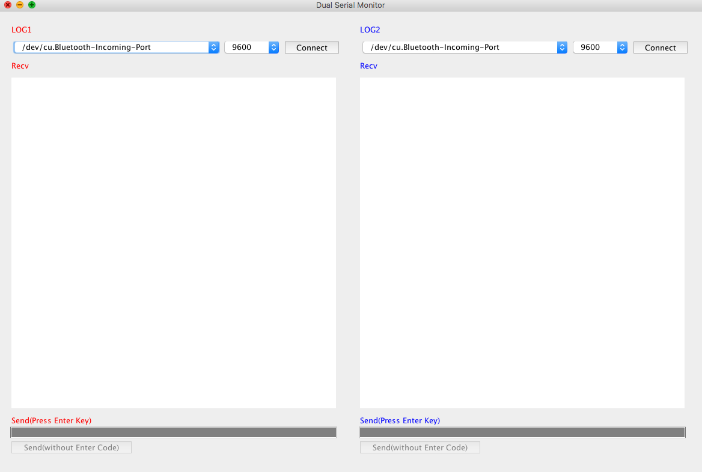

# Dual Serial Monitor

Dual Serial Monitor is enable to use 2 serial console at the same time.

### Usage

### Plugins

Dual Serial Monitor is currently extended with the following plugins. Instructions on how to use them in your own application are linked below.

| Plugin | README |
| ------ | ------ |
| Serial | [https://processing.org/reference/libraries/serial/index.html |
| AWT | [https://docs.oracle.com/javase/7/docs/api/java/awt/package-summary.html] |
| Swing | [https://www.javatpoint.com/java-swing] |

### Todos

 - Write MORE Tests

License
----

MIT

